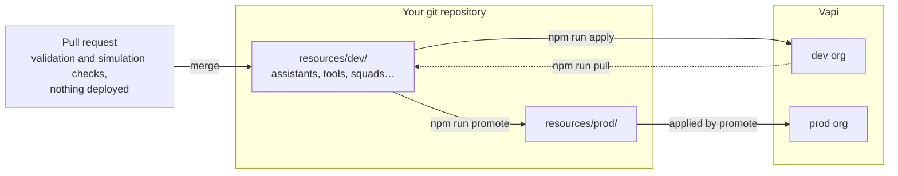

# Vapi GitOps

[](https://github.com/VapiAI/gitops/actions/workflows/ci.yml)

Manage your Vapi voice agents as code. Assistants, squads, tools, structured
outputs, simulations and evals live as YAML and Markdown files in git, and this
repository's CLI syncs them to your Vapi orgs, promotes them from development to
production, and tests every pull request with simulations before it merges.

New to Vapi? Start with the [Vapi documentation](https://docs.vapi.ai), then
come back here to manage what you build.

## What you get

- **Safe sync.** `npm run apply` pulls the latest platform state before it
  pushes, so edits made in the dashboard aren't silently overwritten. Every
  deploy writes a snapshot you can roll back to.
- **Any number of orgs.** Each Vapi org is a folder. Promote resources between
  them (dev → staging → production) with credentials and phone numbers bound
  per org.
- **Tests on every pull request.** Simulation suites run against the branch's
  own files, with tools mocked and nothing deployed, and report a
  `Vapi Evals` status that links to the run.
- **A field guide to Vapi.** [`docs/learnings/`](docs/learnings/README.md)
  collects hard-won gotchas and recipes for assistants, squads, transfers,
  voicemail detection, latency and more.
- **Ready for coding agents.** [`AGENTS.md`](AGENTS.md) and
  [`CLAUDE.md`](CLAUDE.md) teach Claude Code, Cursor and Codex how to work in
  the repo safely.

## How it works



You edit files and review changes in pull requests. The CLI turns readable
references (`toolIds: [lookup-patient]`) into the UUIDs each org uses, so the
same files work in every org.

## Why GitOps?

|                       | Dashboard / Ad-hoc API                                          | GitOps                                     |
| --------------------- | --------------------------------------------------------------- | ------------------------------------------ |
| **History**           | Limited visibility of who changed what                          | Full git history with blame                |
| **Review**            | Changes go live immediately (can break things)                  | PR review before deploy                    |
| **Rollback**          | Manual recreation                                               | `git revert`, then `npm run apply`         |
| **Environments**      | Tedious to copy-paste between envs                              | Same config, different state files         |
| **Collaboration**     | One person at a time. Need to duplicate assistants, tools, etc. | Team can collaborate and use git branching |
| **Reproducibility**   | "It worked on my assistant!"                                    | Declarative, version-controlled            |
| **Disaster Recovery** | Hope you have backups                                           | Re-apply from git                          |

## Quick start

### 1. Get your own copy

Your copy will hold your agents' prompts and configuration, so make it a
private repository. Pick one:

- **Keep upstream history (recommended).** You can pull in future updates with
  an ordinary merge.

  ```bash
  git clone https://github.com/VapiAI/gitops.git my-vapi-gitops
  cd my-vapi-gitops
  git remote rename origin upstream
  git remote add origin <your-private-repo-url>
  git push -u origin main
  ```

- **Use this template.** Click **Use this template** on GitHub for a fresh
  repository with clean history. Updates are still possible, but the first one
  needs an extra step (see [Staying up to date](#staying-up-to-date)).

Avoid a public fork: it would publish your configuration.

### 2. Install

You need Node.js 20.12+ or 22.13+ (`.nvmrc` pins 22) and a Vapi **private API
key** for each org, from [dashboard.vapi.ai/org/api-keys](https://dashboard.vapi.ai/org/api-keys).

```bash
nvm use
npm ci
```

### 3. Connect an org

```bash
npm run setup
```

The wizard asks for your API key (and detects the US or EU region), a name for
the org's folder (for example `my-org`), and which existing resources to
download, offering their dependencies too. It creates `.env.my-org` (your key, gitignored) and
`resources/my-org/`. Run it again to add more orgs.

#### Without a terminal (coding agents, CI)

The wizard needs a real terminal. Coding agents (Claude Code, Cursor, Codex, …) and CI
run commands without one, so pass the org name to skip every prompt:

```bash
# Option A — a human creates the env file, so the key never passes through the agent
cp .env.example .env.my-org          # then paste the private API key into VAPI_PRIVATE_API_KEY
npm run setup -- my-org

# Option B — the key is already in the environment (CI secret, shell export)
VAPI_PRIVATE_API_KEY=... npm run setup -- my-org
```

| Option | Default | Meaning |
| --- | --- | --- |
| `--region us\|eu` | `VAPI_BASE_URL` if set, else auto-detect (US, then EU) | Which Vapi API to use |
| `--resources all\|none` | `all` | `all` downloads every resource into `resources/<org>/`; `none` only seeds `.vapi-state.<org>.json` (use when you'll author from scratch) |

The private API key is never accepted as a command-line flag (it would leak into shell history and
agent transcripts). Non-interactive setup also refuses to run if `resources/<org>/` or
`.vapi-state.<org>.json` already exists — use `npm run pull -- <org>` to refresh an existing org.

### 4. Make a change and deploy

Edit a file under `resources/my-org/` (or start from the
[starter example](examples/starter/README.md)), then:

```bash
npm run validate -- my-org   # schema check, no network
npm run apply -- my-org      # pull the latest, merge, push
```

Commit the changed files and `.vapi-state.my-org.json` so your team shares the
same name → UUID mappings.

### 5. Test it

```bash
npm run call -- my-org -a my-assistant              # talk to it from your terminal
npm run sim -- my-org --suite core --target my-squad # run a simulation suite
```

To test every pull request automatically, set up [PR checks](docs/guides/pr-checks.md).

## Core concepts

- **One folder per org.** `resources/<org>/` holds that org's resources, in
  folders by type (`assistants/`, `tools/`, `squads/`, `structuredOutputs/`,
  `evals/`, `simulations/`). Org names are yours to choose (`acme-dev`,
  `acme-prod`).
- **Resources refer to each other by ID.** A resource's ID is its path under
  the type folder, without the extension: `tools/lookup-patient.yml` is
  `lookup-patient`. Never paste UUIDs into resource files.
- **The state file maps IDs to UUIDs.** `.vapi-state.<org>.json` records which
  platform resource each file is, per org. It is committed and holds no
  secrets.
- **Secrets stay out of git.** API keys live in `.env.<org>` (gitignored) or
  CI secrets. Credentials are referenced by name and bound to each org's own
  credentials.
- **`apply` is the default deploy.** It pulls first, so it won't overwrite
  changes made in the dashboard since your last pull. `pull` only syncs down;
  raw `push` skips the pull and is rarely what you want.

| Path | Committed? | What it is |
| --- | --- | --- |
| `resources/<org>/` | Yes | Your resources |
| `.vapi-state.<org>.json` | Yes | Name → UUID mappings for the org |
| `.env.<org>` | **No** | API key and generated binding IDs |
| `.vapi-state-hash/` | No | Your local baseline for detecting dashboard edits |
| `.vapi-state.<org>.snapshots/` | No | Pre-deploy snapshots for `npm run rollback` |

More detail: [How the engine works](docs/guides/how-it-works.md).

## Commands

| Command | What it does |
| --- | --- |
| `npm run setup` | Connect an org: create `.env.<org>` and `resources/<org>/` |
| `npm run validate -- <org>` | Check resource files offline before deploying |
| `npm run apply -- <org>` | Deploy: pull, merge, then push (the default) |
| `npm run pull -- <org>` | Sync platform changes down without overwriting local edits |
| `npm run push -- <org>` | Push without pulling first (prefer `apply`) |
| `npm run rollback -- <org>` | Restore a pre-deploy snapshot |
| `npm run cleanup -- <org>` | Find, and optionally delete, platform resources with no file |
| `npm run audit -- <org>` | Report drift between files, state and the platform |
| `npm run call -- <org>` | Talk to an assistant or squad from your terminal |
| `npm run sim -- <org>` | Run a simulation suite against deployed resources |
| `npm run check` | Run PR simulation checks against local files |
| `npm run promote` | Promote resources from one org to the next |

`setup`, `apply`, `pull`, `push`, `cleanup` and `call` prompt interactively
when run without arguments. Full flags and examples:
[Commands](docs/guides/commands.md).

## Guides

| Guide | Read it to… |
| --- | --- |
| [Everyday workflows](docs/guides/workflows.md) | Deploy, pull safely, recover from a bad deploy, clean up |
| [File formats](docs/guides/file-formats.md) | Write assistants, tools, squads, structured outputs and simulations |
| [Resource reference](docs/guides/resource-reference.md) | Look up every setting, with examples |
| [Writing system prompts](docs/guides/writing-prompts.md) | Structure a voice agent's prompt |
| [PR checks](docs/guides/pr-checks.md) | Test every pull request with simulations |
| [Promotion](docs/guides/promotion.md) | Move resources from dev to staging to production |
| [How the engine works](docs/guides/how-it-works.md) | Understand sync, references, credentials and state |
| [Configuration](docs/guides/configuration.md) | Environment variables and secrets |
| [Troubleshooting](docs/guides/troubleshooting.md) | Fix common errors |

## Learn Vapi: the field guide

[`docs/learnings/`](docs/learnings/README.md) is a library of behaviours the
API reference doesn't spell out, collected from real deployments. Some
starting points:

| If you're working on… | Read |
| --- | --- |
| Transfers that don't connect | [transfers.md](docs/learnings/transfers.md) |
| Squads and handoffs | [squads.md](docs/learnings/squads.md) |
| Voicemail vs human detection | [voicemail-detection.md](docs/learnings/voicemail-detection.md) |
| Making your agent faster | [latency.md](docs/learnings/latency.md) |
| Simulations and test suites | [simulations.md](docs/learnings/simulations.md) |
| Prompt writing | [Vapi Prompt Optimization Guide](docs/Vapi%20Prompt%20Optimization%20Guide.md) |

## Supported resources

| Resource               | Format                                       |
| ---------------------- | -------------------------------------------- |
| **Assistants**         | `.md` (system prompt as Markdown) or `.yml`  |
| **Tools**              | `.yml`                                       |
| **Structured Outputs** | `.yml`                                       |
| **Squads**             | `.yml`                                       |
| **Personalities**      | `.yml`                                       |
| **Scenarios**          | `.yml`                                       |
| **Simulations**        | `.yml`                                       |
| **Simulation Suites**  | `.yml`                                       |
| **Evals**              | `.yml`                                       |

Any resource can also be a `.ts` file that default-exports the resource
object. API references: [Assistants](https://docs.vapi.ai/api-reference/assistants/create),
[Tools](https://docs.vapi.ai/api-reference/tools/create),
[Structured Outputs](https://docs.vapi.ai/api-reference/structured-outputs/structured-output-controller-create),
[Squads](https://docs.vapi.ai/api-reference/squads/create),
[Evals](https://docs.vapi.ai/api-reference/evals).

## Staying up to date

The engine (`src/`, `tests/`, `.github/workflows/`, `package*.json`) comes from
upstream. Your configuration (`resources/`, `.vapi-state.*.json`,
`promotion.yml`, `vapi-checks.yml`) is yours; upstream only ships `*.example`
files there. Avoid editing engine files, so updates merge cleanly.

```bash
git fetch upstream
git merge upstream/main
npm ci && npm run build && npm test
```

If you started from **Use this template**, add the remote first with
`git remote add upstream https://github.com/VapiAI/gitops.git`; the first merge
also needs `--allow-unrelated-histories`, and you'll resolve conflicts once.

## Security

Never commit API keys: `.env.*` files are gitignored, and the CLI never accepts
a key as a command-line flag. `.ts` resource files execute when loaded, so
review them like code. To report a vulnerability, see [SECURITY.md](SECURITY.md).

## Contributing and license

Issues and pull requests are welcome; see [CONTRIBUTING.md](CONTRIBUTING.md).
Licensed under [Apache 2.0](LICENSE).
